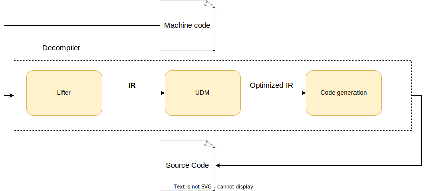
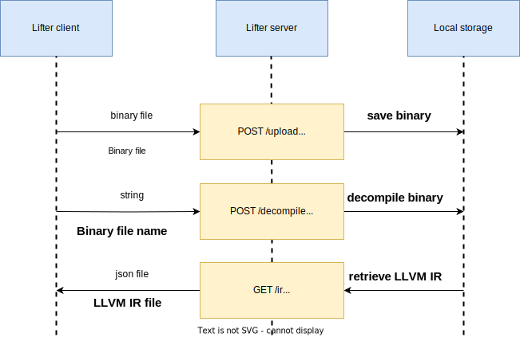

# **Reverse Engineering Tool**

## About

-----------------------

This is a tool that provides a pilot solution for decompiling combining multiple state-of-the-art techniques and also employs solid software that has been developed of the course of many years such as LLVM, Capstone, RetDec, etc.
It comprises three modules: Lifter, Universal Decompiling Machine and Code Generation.

- **Overview of the decompiler**:
  - 

- **Lifter** - This module is responsible for lifting the binary code to LLVM IR code. It uses the RetDec service to do that. This id done by implementation of a Typescript server that communicates with a C++ client.
  - Lifter server architecture:
    
- **Universal Decompiling Machine** - This module is responsible for two things namely: control flow analysis and data flow analysis.
  - **Control flow analysis** - this step is responsible for finding information about loops, conditionals, latch nodes, follow node etc.
  - **Data flow analysis** - is responsible for optimizing the LLVM IR code received from the lifter.
- **Code Generation** - This module generates the final high-level DSL, using all the information gathered before and making the results more readable for the user.

## Dependencies

-----------------------

| **Name** | **Version** | **Name** | **Version** |
| --- |:-----------:|----------|:-----------:|
| Cmake |   \>= 22    | Capstone |  \>= 4.0.2  |
| LLVM |   \>= 14    | cpprest  | \>= 2.10.18 |
| spdlog |   latest    | curl     | \>= 7.85.0  |
| C++ |     20      | QT       |  \>= 6.2.1  |

## How to Install & Run

-----------------------

### MacOS & Linux

------------------------

#### **C++ project**

- homebrew install cmake
- homebrew install llvm
- homebrew install spdlog
- homebrew install capstone
- homebrew install cpprestsdk
- homebrew install curl
- homebrew install qt

* Make sure that the dependencies are installed in the default location, thus allowing
access to the FindXXX.cmake files to work properly in the find_package() function of the
CMakeLists.txt file.
* Make sure that all the versions of the dependencies are the same as the ones specified in the above table.
* After all the dependencies where found execute run.sh script to build the project.
* For Linux users, instead of homebrew use the package manager of your choice to install the dependencies.

### Windows

------------------------

* Building the application has not been tested on Windows yet, but it should work if the dependencies are installed.
* All the C++ code is cross-platform, so it should work on Windows as well.

## Lifter server

-----------------------

- compatible only with x86_64 machines and only with linux.
- execute the getRetdec.sh script to download the RetDec service.
- execute npm install to install the dependencies of the server.
- execute npm start to start the server.
- the server will be listening on port 29200 by default, this can be changed.
- also you will need to provide the URL for access to the RetDec service in the LifterSettings.json file from the C++ project.

